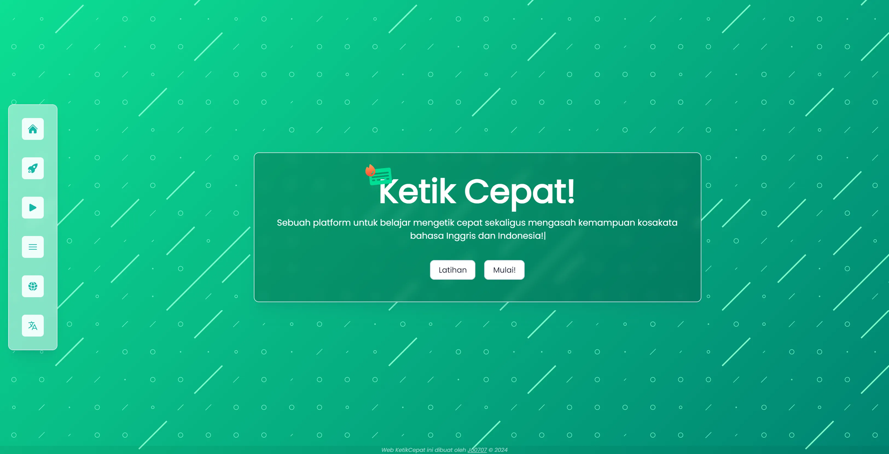
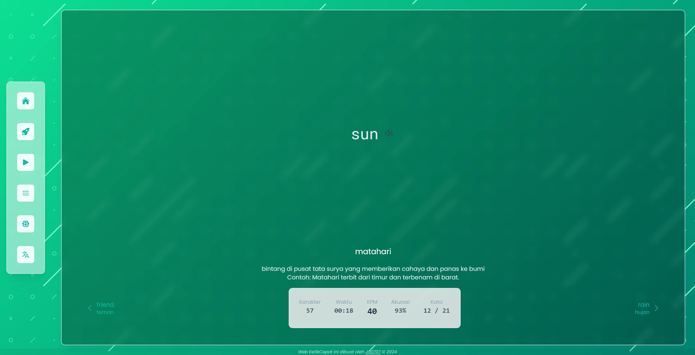
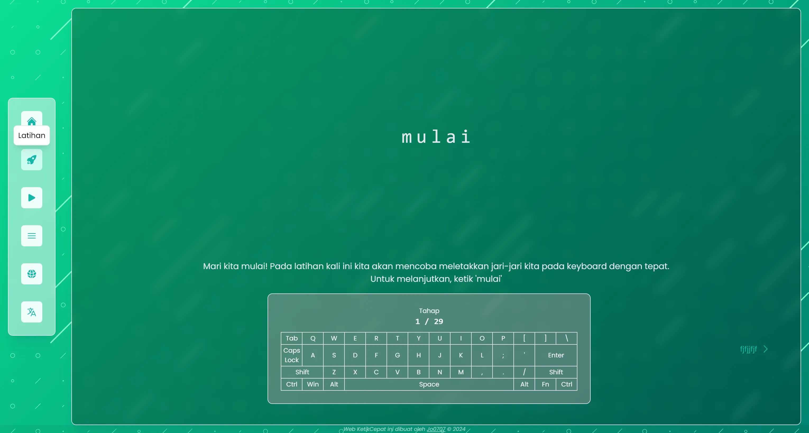

<h1 align="center">Ketik Cepat!</h1>

<p align="center">
  
</p>

<p align="center">
    Ketik Cepat! adalah sebuah website untuk latihan mengetik dalam bahasa Inggris dan Indonesia yang bertujuan melatih anak bangsa dalam menggunakan komputer sembari belajar bahasa Inggris. 
</p>

## App

Demo: [KetikCepat!](https://ketikcepat.jooo.my.id/)

<p align="center" style="width:75%">
  
  
  
</p>

## Library, Frameworks & Tools yang Digunakan

-   [Nuxt 3](https://nuxt.com/)
    -   [Nuxt UI](https://ui.nuxt.com/)
    -   [Nuxt SEO](https://nuxtseo.com/)
    -   [Nuxt VueUse](https://vueuse.org/)
    -   [Nuxt Fonts](https://fonts.nuxt.com/)
    -   [Nuxt Image](https://image.nuxt.com/)
    -   [Nuxt Pinia](https://pinia.vuejs.org/ssr/nuxt.html)
    -   [Nuxt mdc](https://github.com/nuxt-modules/mdc)
    -   [Vue3 Carousel Nuxt](https://nuxt.com/modules/vue3-carousel-nuxt)
-   [TailwindCSS](https://tailwindcss.com/)
-   [Animate On Scroll](https://michalsnik.github.io/aos/)
-   [js-confetti](https://github.com/loonywizard/js-confetti)
-   [Howler.js](https://howlerjs.com/)
-   [Bun](https://bun.sh/)

## Setup & Build

Jika kamu ingin menjalankan project ini di local, ikuti langkah-langkah berikut:

-   Clone project ini

```bash
git clone https://github.com/jo0707/ketikcepat
```

-   Pindah direktori ke direktori project

```bash
cd ketikcepat
```

-   Install dependencies (bun)

```bash
bun install
```

-   Jalankan project

```bash
bun dev
```

-   Build project

```bash
bun run build
#or
bun run generate # static hosting
```

Selesai!

## Kredit

<p align="center">
Repository ini terinspirasi dari website <a href="https://github.com/RealKai42/qwerty-learner">Qwerty Learner</a> dan <a href="https://github.com/diosamuel/suaratangan">Suara Tangan - @diosamuel</a>
</p>

## Contributing

Made by [jo0707](https://github.com/jo0707)

Feel free to contribute to this repository!
